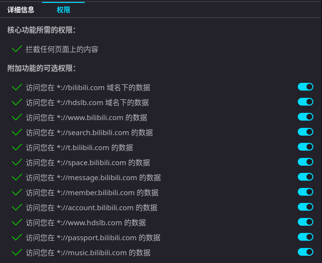

# # BeriBeri(べりべり)

 [简体中文](README.md) | 繁体中文 | [廣東話](README-jyut.md)

 

只需對您的 Bilibili 主頁進行一些小改動就好。

該 GitHub 倉庫是唯一發佈渠道。

本項目是基於 <a href="https://github.com/BewlyBewly/BewlyBewly">BewlyBewly</a> 的修改版。

<!-- 
 -->

## 👋 介紹

> [!IMPORTANT]
> BeriBeri 主要著重於頁面調整和改良，而不是完善功能和提升效率。
>
> 由於考慮到效率和維護困難度，深色模式只會適應常用的頁面，而較少使用的頁面則不會支護。

> [!CAUTION]
> 如果您正在安裝此擴充功能，您的瀏覽器可能會提示它可以讀取您的瀏覽歷史記錄。
>
> 這是因爲 BeriBeri 使用了["tabs" 權限](https://developer.chrome.com/docs/extensions/reference/api/tabs)，該權限也可用於讀取每個分頁，從而瞭解瀏覽歷史，但在這裏並未使用。
>
> **一些瀏覽器會提到最壞的情況和最高的風險，以確保您在安裝後的安全。**
> 此外，這個專案是開源的，所以您可以看到它究竟做了什麼。

BeriBeri 是一個針對 BiliBili 的瀏覽器擴充功能，旨在透過重新設計 BiliBili 的介面來提升用戶體驗。設計靈感來自於 YouTube、Vision OS 和 iOS，使介面更具視覺吸引力和用戶友好性。

該專案使用 [vitesse-webext](https://github.com/antfu/vitesse-webext) 範例進行開發。如果沒有此範例，可能無法開發出此專案。

## ⬇️ 安裝

### 線上安裝

<!--
> [!TIP]
> 即使您使用的是 Edge 瀏覽器，我們仍然強烈建議您從 Chrome 線上應用程式商店安裝。在審核速度上，Chrome 線上應用程式商店比 Edge 的附加元件快很多。
>
> 此外，BewlyBewly 的 Chrome Web Store 版本將更快地解決和修復關鍵性的錯誤。-->

#### 給 Firefox 使用者的提示

> [!WARNING]
> 使用 Firefox 瀏覽器時，請記得啓用下圖所示的所有權限，以便正常使用 BewlyBewly

  

### 離線安裝

[CI](https://github.com/TC999/BeriBeri/actions)：自動建置最新的程式碼

[發行版](https://github.com/TC999/BeriBeri/releases)：穩定版本
TC999/BeriBeri
#### Edge 和 Chrome (推薦)

> 確保您已下載 [extension.zip](https://github.com/TC999/BewlyBewly-Beta/releases)。

在 Edge 中打開 `edge://extensions` 頁面或在 Chrome 中打開 `chrome://extensions` 頁面，只需將下載的 `extension.zip` 檔案拖放到瀏覽器中，即可完成安裝。

 
 Edge 和 Chrome 的另一種安裝方法 

#### Edge

> 確保您已下載 [extension.zip](https://github.com/TC999/BeriBeri/releases) 並且解壓縮此檔案。

1. 在地址欄中輸入 `edge://extensions/`，然後按下 Enter 鍵
2. 打開`開發者模式`，然後按下`載入解壓縮`   
3. 將已解壓縮的擴充功能的資料夾載入到您的瀏覽器

#### Chrome
>
> 確保您已下載 [extension.zip](https://github.com/TC999/BeriBeri/releases) 並且解壓縮此檔案。

1. 在地址欄中輸入 `chrome://extensions/`，然後按下 Enter 鍵
2. 打開`開發者模式`，然後按下`載入解壓縮`   
3. 將已解壓縮的擴充功能的資料夾載入到您的瀏覽器

## 🤝 貢獻與建置專案

詳情 [CONTRIBUTING.md](docs/CONTRIBUTING-cmn_TW.md)

### 貢獻者

## ❤️ 鳴謝

- [BewlyBewly](https://github.com/BewlyBewly/BewlyBewly) - 原始專案
- [vitesse-webext](https://github.com/antfu/vitesse-webext) - 此專案所用的範例
- [UserScripts/bilibiliHome](https://github.com/indefined/UserScripts/tree/master/bilibiliHome), [bilibili-app-recommend](https://github.com/magicdawn/bilibili-app-recommend) - 參考取得 access key 之方法
- [Bilibili-Evolved](https://github.com/the1812/Bilibili-Evolved) - 部分功能的實現
- [bilibili-API-collect](https://github.com/SocialSisterYi/bilibili-API-collect)
